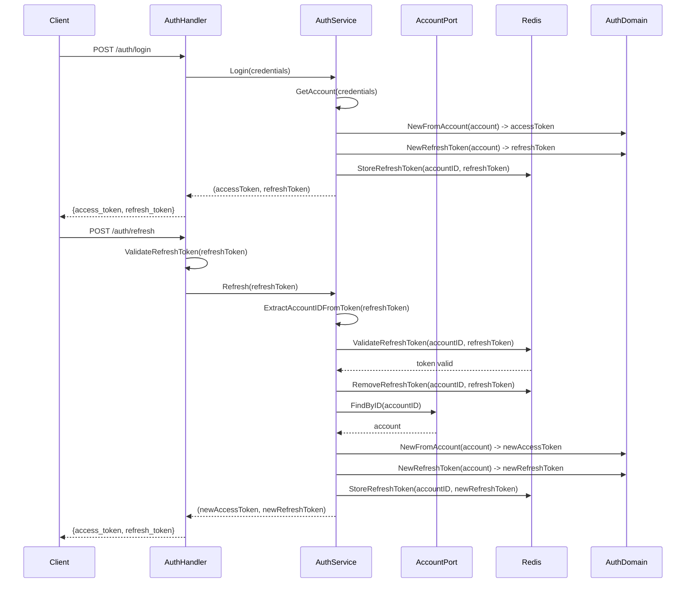

# Implementação de Refresh Tokens no Backend

## Visão Geral

Implementar um sistema completo de refresh tokens seguindo as melhores práticas de segurança, incluindo:

- Geração separada de access tokens e refresh tokens
- Armazenamento seguro de refresh tokens no Redis
- Refresh token rotation (gera novos tokens a cada refresh)
- Endpoint funcional para refresh de tokens
- Validação e expiração diferenciadas

## Arquitetura

O fluxo seguirá este padrão:

## Implementação

### 1. Atualizar domínio de Authorization

**Arquivo**: `src/core/domain/authorization/authorization.go`

- Adicionar constante `REFRESH_TOKEN_TIMEOUT = 7 * 24 * time.Hour` (7 dias)
- Adicionar constante `REFRESH_TOKEN_TYPE = "refresh"`
- **Manter interface `Authorization` como está** (não adicionar `RefreshToken()`)
- Adicionar método `NewRefreshToken(acc account.Account) (Authorization, errors.Error)` - similar a `NewFromAccount`, mas com tipo "refresh" e expiração de 7 dias
- Manter `NewFromAccount()` como está (gera access token)

**Arquivo**: `src/core/domain/authorization/claims.go`

- Manter estrutura `AuthClaims` existente (já tem campo `Type`)
- O tipo será usado para diferenciar access tokens (`bearer`) de refresh tokens (`refresh`)

### 2. Atualizar interface SessionPort

**Arquivo**: `src/core/interfaces/secondary/session.go`

- Adicionar método `StoreRefreshToken(uID *uuid.UUID, refreshToken string) errors.Error`
- Adicionar método `ValidateRefreshToken(uID *uuid.UUID, refreshToken string) (bool, errors.Error)`
- Adicionar método `RemoveRefreshToken(uID *uuid.UUID, refreshToken string) errors.Error`
- Adicionar método `RemoveAllRefreshTokens(uID *uuid.UUID) errors.Error` (usado no logout)

### 3. Implementar armazenamento de refresh tokens no Redis

**Arquivo**: `src/infra/redis/session.go`

- Implementar `StoreRefreshToken()` - armazena refresh token com TTL de 7 dias usando chave `refresh_token:{uuid}` -> refreshToken
- Implementar `ValidateRefreshToken()` - valida se o refresh token existe no Redis para aquele accountID
- Implementar `RemoveRefreshToken()` - remove refresh token específico do Redis (usado em rotation)
- Implementar `RemoveAllRefreshTokens()` - remove todos os refresh tokens da conta (usado no logout)
- Adicionar método auxiliar `getUserRefreshTokenKey(uID *uuid.UUID) string` que retorna `refresh_token:{uuid}`
- **Nota**: Começar com estrutura simples (chave única por accountID). Suporte a múltiplos dispositivos (SET) pode ser adicionado futuramente.

### 4. Adicionar AccountPort ao authService

**Arquivo**: `src/core/services/auth.go`

- Adicionar campo `accountPort secondary.AccountPort` na struct `authService`
- Atualizar `NewAuthService()` para receber `accountPort secondary.AccountPort` como parâmetro
- Atualizar assinatura: `NewAuthService(adapter, sessionPort, passwordResetPort, accountPort)`

**Arquivo**: `src/apps/api/dicontainer/dicontainer.go`

- Atualizar `AuthServices()` para injetar `AccountPort` no `authService`
- Usar `postgres.NewAccountRepository()` como `AccountPort`

### 5. Atualizar serviço de autenticação

**Arquivo**: `src/core/services/auth.go`

- Atualizar método `Login()` para:
  - **Sempre gerar novos tokens** (não retornar sessão existente)
  - Remover sessão antiga se existir
  - Gerar access token usando `authorization.NewFromAccount(account)`
  - Gerar refresh token usando `authorization.NewRefreshToken(account)`
  - Armazenar refresh token no Redis usando `sessionPort.StoreRefreshToken()`
  - Retornar ambos os tokens (access e refresh)

- Adicionar método `Refresh(refreshToken string) (authorization.Authorization, authorization.Authorization, errors.Error)`:
  - Extrair claims do refresh token usando `utils.ExtractTokenClaims(refreshToken)`
  - Validar se `claims.Type == authorization.REFRESH_TOKEN_TYPE` (deve ser "refresh")
  - Extrair `accountID` dos claims (`claims.AccountID`)
  - Validar o refresh token no Redis: `sessionPort.ValidateRefreshToken(accountID, refreshToken)`
  - Se inválido, retornar erro usando `messages.InvalidRefreshTokenErrorMessage`
  - Remover o refresh token antigo do Redis (rotation): `sessionPort.RemoveRefreshToken(accountID, refreshToken)`
  - Buscar Account completo: `s.accountPort.FindByID(accountID)`
  - Gerar novos access token: `authorization.NewFromAccount(account)`
  - Gerar novo refresh token: `authorization.NewRefreshToken(account)`
  - Armazenar novo refresh token: `sessionPort.StoreRefreshToken(accountID, newRefreshToken)`
  - Retornar ambos os novos tokens

### 6. Atualizar interface AuthPort

**Arquivo**: `src/core/interfaces/primary/auth.go`

- Adicionar método `Refresh(refreshToken string) (authorization.Authorization, authorization.Authorization, errors.Error)`

### 7. Adicionar validação de refresh token nos utils

**Arquivo**: `src/apps/api/utils/auth.go`

- Adicionar função `ValidateRefreshToken(refreshToken string) (*authorization.AuthClaims, bool)`:
  - Extrair claims usando `ExtractTokenClaims(refreshToken)`
  - Validar assinatura JWT usando `jwt.Parse()` com `SERVER_SECRET`
  - Verificar se token é válido e não expirado
  - Verificar se `claims.Type == "refresh"` (não "bearer")
  - Retornar claims e true se válido, nil e false caso contrário

### 8. Atualizar resposta de autorização

**Arquivo**: `src/apps/api/handlers/dto/response/authorization.go`

- Adicionar campo `RefreshToken string \`json:"refresh_token"\`` à struct `Authorization`
- Adicionar método `BuildFromTokens(accessToken, refreshToken authorization.Authorization) *Authorization`:
  - Recebe dois objetos `Authorization` separados
  - Retorna struct `Authorization` com ambos os tokens
- Manter método `BuildFromDomain()` como está (pode ser usado para compatibilidade, mas não será usado para refresh tokens)

### 9. Criar handler de refresh

**Arquivo**: `src/apps/api/handlers/auth.go`

- Adicionar método `Refresh(context RichContext) error` no `AuthHandler`:
  - Validar request body (DTO)
  - Validar refresh token usando `utils.ValidateRefreshToken(refreshToken)`
  - Se inválido, retornar erro com `messages.InvalidRefreshTokenErrorMessage`
  - Chamar `service.Refresh(refreshToken)`
  - Construir resposta usando `response.NewAuthorizationBuilder().BuildFromTokens(accessToken, refreshToken)`
  - Retornar JSON com novos tokens
  - Adicionar documentação Swagger completa

- Criar DTO de request em `src/apps/api/handlers/dto/request/refresh.go`:
  - Struct `RefreshToken` com campo `RefreshToken string` com validação
  - Método `ToDomain() string` (retorna o refresh token diretamente)

### 10. Atualizar handler de login

**Arquivo**: `src/apps/api/handlers/auth.go`

- Atualizar método `Login()`:
  - Ajustar chamada ao serviço para receber ambos os tokens
  - **Nota**: Como `Login()` do serviço agora retorna dois tokens, precisaremos ajustar a assinatura ou criar uma estrutura de retorno
  - **Solução**: Ajustar `Login()` para retornar uma estrutura que contenha ambos os tokens, ou retornar dois valores separados
  - Construir resposta usando `BuildFromTokens(accessToken, refreshToken)`
  - Retornar JSON com ambos os tokens

**Arquivo**: `src/core/interfaces/primary/auth.go` e `src/core/services/auth.go`

- **Decisão arquitetural**: Como `Login()` precisa retornar dois tokens, temos duas opções:
  - Opção A: Retornar tupla `(authorization.Authorization, authorization.Authorization, errors.Error)`
  - Opção B: Criar struct `TokenPair` que contenha ambos os tokens
  - **Recomendação**: Usar Opção A (tupla) para manter simplicidade, similar ao método `Refresh()`

### 11. Atualizar handler de logout

**Arquivo**: `src/core/services/auth.go` e `src/infra/redis/session.go`

- Atualizar `Logout()` no `authService`:
  - Chamar `sessionPort.RemoveSession(accountID)` (remove access token)
  - Chamar `sessionPort.RemoveAllRefreshTokens(accountID)` (remove todos os refresh tokens)

### 12. Configurar rota de refresh

**Arquivo**: `src/apps/api/routes/auth.go`

- Adicionar rota `router.POST("/refresh", middlewares.EnhanceContext(a.handler.Refresh))`
- A rota já está na allowList do middleware (linha 105 de `src/apps/api/middlewares/auth.go`)

### 13. Ajustar assinatura do Login

**Importante**: Como `Login()` precisa retornar dois tokens, precisamos ajustar a interface:

**Arquivo**: `src/core/interfaces/primary/auth.go`

- Atualizar assinatura de `Login()`:
  - De: `Login(credentials.Credentials) (authorization.Authorization, errors.Error)`
  - Para: `Login(credentials.Credentials) (authorization.Authorization, authorization.Authorization, errors.Error)`

**Arquivo**: `src/core/services/auth.go`

- Atualizar implementação de `Login()` para retornar dois valores

## Validação de Refresh Token - Processo Detalhado

O processo de validação de refresh token deve seguir estes passos:

1. **Validação JWT básica**:

   - Extrair claims usando `utils.ExtractTokenClaims(refreshToken)`
   - Validar assinatura usando `jwt.Parse()` com `SERVER_SECRET`
   - Verificar se token não está expirado

2. **Validação de tipo**:

   - Verificar se `claims.Type == "refresh"` (não "bearer")
   - Se tipo incorreto, retornar erro

3. **Validação no Redis**:

   - Extrair `accountID` dos claims (`claims.AccountID`)
   - Chamar `sessionPort.ValidateRefreshToken(accountID, refreshToken)`
   - Se não existe no Redis, retornar erro (`InvalidRefreshTokenErrorMessage`)

4. **Validação de expiração**:

   - Verificar `claims.Expiry` (já validado pelo JWT, mas confirmar)

## Considerações de Segurança

1. **Refresh Token Rotation**: A cada refresh, novos tokens são gerados e o antigo é invalidado
2. **Tempo de Expiração**: Refresh tokens com 7 dias vs 1 hora para access tokens
3. **Armazenamento Seguro**: Refresh tokens armazenados no Redis com TTL apropriado
4. **Tipo de Token**: Refresh tokens têm `typ: "refresh"` nos claims para diferenciação
5. **Logout**: Remove todos os refresh tokens da sessão
6. **Login**: Sempre gera novos tokens (não reutiliza sessões existentes)
7. **Validação Dupla**: Refresh tokens são validados tanto no nível JWT quanto no Redis

## Estrutura de Dados no Redis

- **Access tokens**: `user_session:{uuid}` -> accessToken (TTL: 1 hora)
- **Refresh tokens**: `refresh_token:{uuid}` -> refreshToken (TTL: 7 dias)
- **Nota**: Estrutura inicial simples (chave única por accountID). Suporte a múltiplos dispositivos pode ser adicionado futuramente usando SET do Redis.

## Testes

Criar testes para:

- Geração de refresh tokens no login
- Validação de refresh tokens (tipo correto, claims válidos)
- Validação de refresh token no Redis
- Refresh token rotation (token antigo invalidado após refresh)
- Tentativa de reutilizar refresh token antigo (deve falhar)
- Remoção de refresh tokens no logout
- Expiração de refresh tokens
- Login sempre gera novos tokens (não reutiliza sessão existente)
- Erro ao tentar refresh com token tipo incorreto
- Erro ao tentar refresh com token não encontrado no Redis